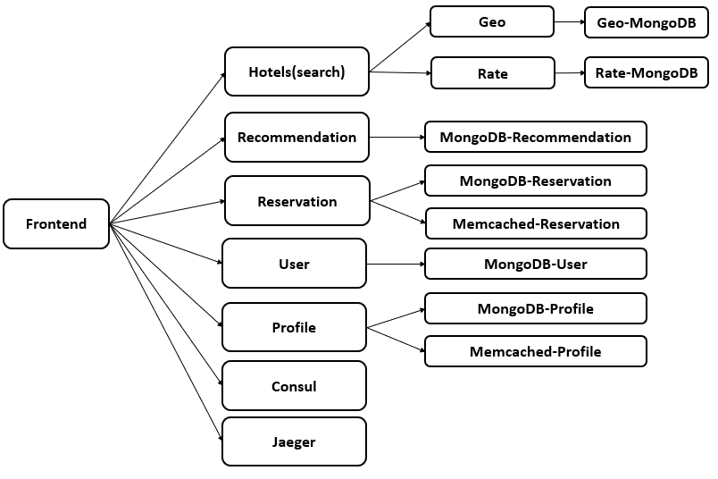
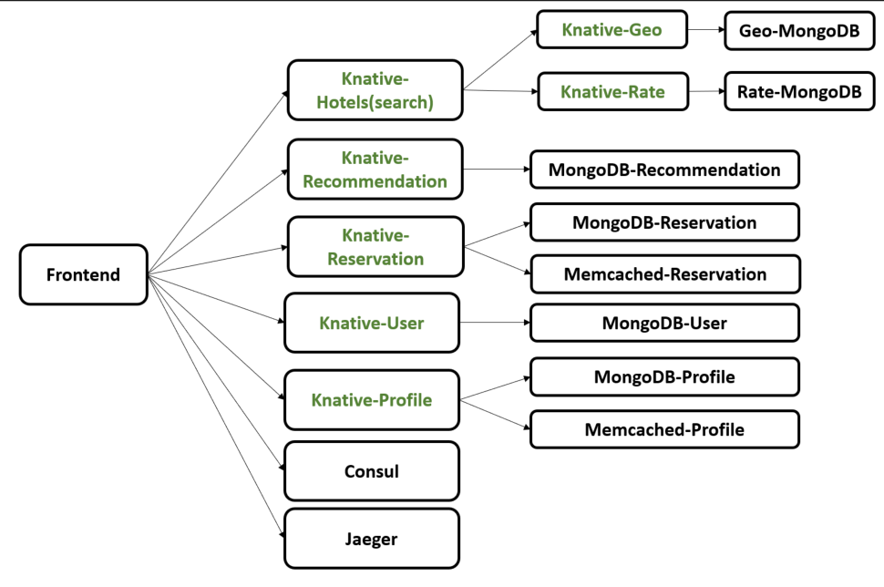

# Hotel Reservation Knative workloads

The application implements a hotel reservation service, build with Go and gRPC, and starting from the open-source project https://github.com/harlow/go-micro-services. The initial project is extended in several ways, including adding back-end in-memory and persistent databases, adding a recommender system for obtaining hotel recommendations, and adding the functionality to place a hotel reservation.

**Hotel Reservation** includes the relationships of end-to-end services are as follows:



In **Knative workloads**, the services marked **Green** are refactored from k8s services to Knative services:



The ``Frontend Service`` and the ``Backend storage services`` are not transfered to knative, which represents the middle layer mostly deal with the high volumes of HTTP traffic in FaaS workloads.


## Pre-requirements
- Kubernetes
- Knative Serving
- Istio

## Running the hotel reservation application
### Before you start

- Make sure your kubernetes cluster running steadily
- Install ``Knative Serving`` and ``Istio``
    - Install ``knative Serving`` following Doc:
    [Install Serving](https://knative.dev/docs/install/yaml-install/serving/install-serving-with-yaml/#install-the-knative-serving-component)
    - Install`` a networking layer Istio`` following Doc:
    [Install a networking layer Istio for knative](https://knative.dev/docs/install/yaml-install/serving/install-serving-with-yaml/#install-a-networking-layer)
    - Configuring DNS ``sslip.so`` as domain name of the ingress gateway IP:
    [Configuring DNS for Istio](https://knative.dev/docs/install/installing-istio/#verifying-your-istio-install)

## Deploy knative services in kubernetes
### Build images
```bash
cd <path-of-repo>/hotelReservation/knative/scripts
./update-config.sh
cd ../..
docker build . -t $yourdockername
```
### Deploy services in kubernetes and knative
```bash
cd <path-of-repo>/hotelReservation/knative/scripts
./deploy-knative-svc.sh
```
### Verify knative services are ready
```bash
kubectl get ksvc
# you will see the output like the following
NAME                 URL                                                        LATESTCREATED              LATESTREADY                READY   REASON
srv-geo              http://srv-geo.default.10.108.189.25.sslip.io              srv-geo-00001              srv-geo-00001              True
srv-profile          http://srv-profile.default.10.108.189.25.sslip.io          srv-profile-00001          srv-profile-00001          True
srv-rate             http://srv-rate.default.10.108.189.25.sslip.io             srv-rate-00001             srv-rate-00001             True
srv-recommendation   http://srv-recommendation.default.10.108.189.25.sslip.io   srv-recommendation-00001   srv-recommendation-00001   True
srv-reservation      http://srv-reservation.default.10.108.189.25.sslip.io      srv-reservation-00001      srv-reservation-00001      True
srv-search           http://srv-search.default.10.108.189.25.sslip.io           srv-search-00001           srv-search-00001           True
srv-user             http://srv-user.default.10.108.189.25.sslip.io             srv-user-00001             srv-user-00001             True
```
### Workload generation
```bash
../wrk2/wrk -D exp -t <num-threads> -c <num-conns> -d <duration> -L -s ./wrk2/scripts/hotel-reservation/mixed-workload_type_1.lua http://x.x.x.x:5000 -R <reqs-per-sec>
```
