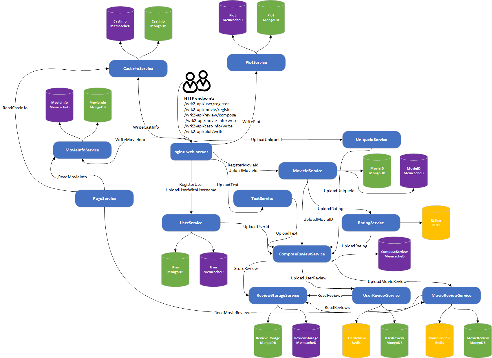

# Media Microservices

## Workload architecture


## Dependencies
- thrift C++ library
- mongo-c-driver
- libmemcached
- nlohmann/json https://nlohmann.github.io/json/

## Pre-requirements
- Docker
- Docker-compose
- Python 3.5+ (with asyncio and aiohttp)
- libssl-dev (apt-get install libssl-dev)
- libz-dev (apt-get install libz-dev)
- luarocks (apt-get install luarocks)
- luasocket (luarocks install luasocket)

## Running the media service application
### Before you start
- Install Docker and Docker Compose.
- Make sure the following ports are available: port `8080` for Nginx frontend and 
  `16686` for Jaeger.

### Start docker containers
Start docker containers by running `docker-compose up -d`. All images will be 
pulled from Docker Hub.

### Register users and movie information
```
python3 scripts/write_movie_info.py -c <path-to-casts.json> -m <path-to-movies.json> --server_address <address:port> && scripts/register_users.sh && scripts/register_movies.sh
```

### Running HTTP workload generator
#### Make
```bash
cd ../wrk2
make
```
back to mediaMicroservices
```bash
cd ../mediaMicroservices
```

#### Compose reviews
```bash
../wrk2/wrk -D exp -t <num-threads> -c <num-conns> -d <duration> -L -s ./wrk2/scripts/media-microservices/compose-review.lua http://localhost:8080/wrk2-api/review/compose -R <reqs-per-sec>
```

#### View Jaeger traces
View Jaeger traces by accessing `http://localhost:16686`
