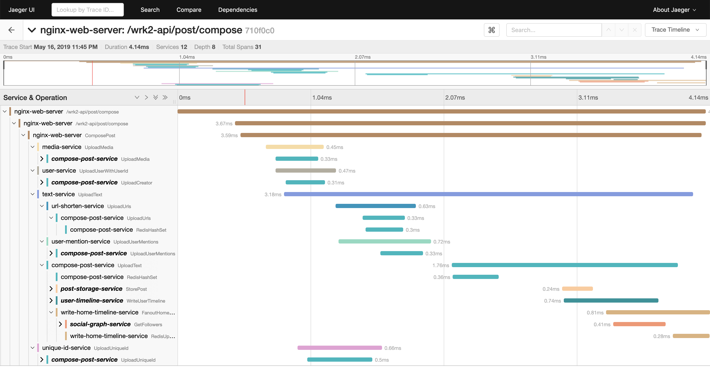
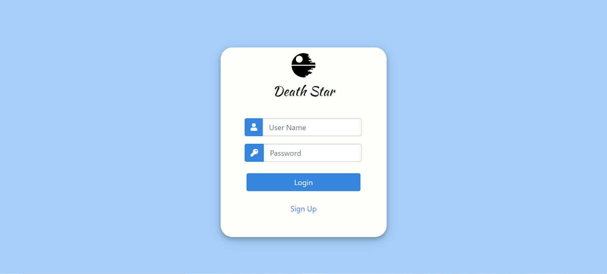
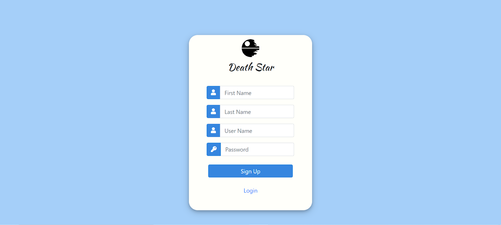
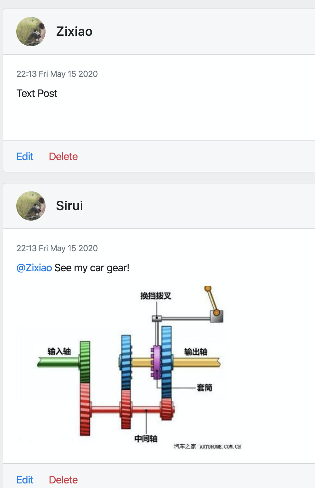
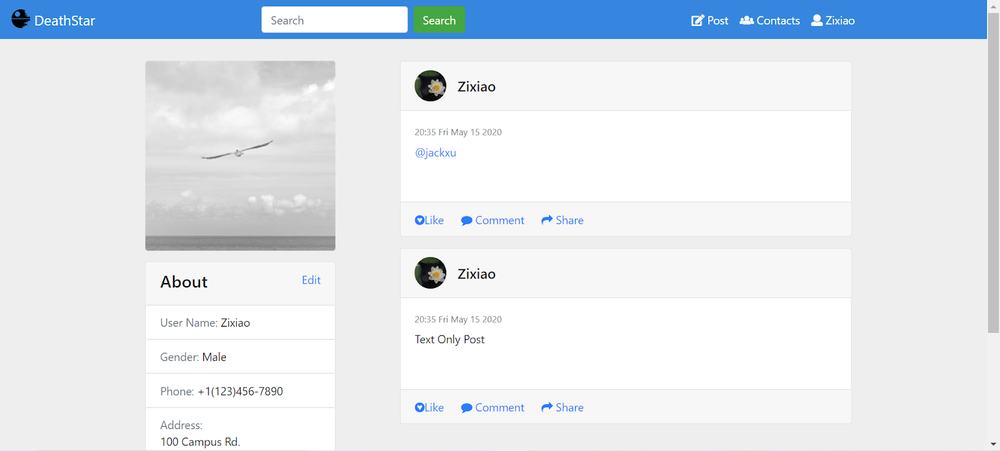
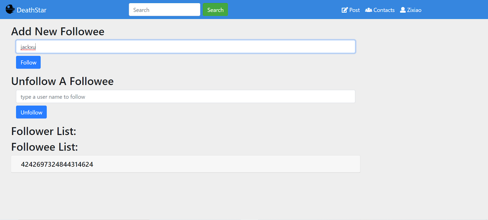

# Social Network Microservices

A social network with unidirectional follow relationships, implemented with loosely-coupled microservices, communicating with each other via Thrift RPCs.

## Application Structure


Supported actions:

* Create text post (optional media: image, video, shortened URL, user tag)
* Read post
* Read entire user timeline
* Receive recommendations on which users to follow
* Search database for user or post
* Register/Login using user credentials
* Follow/Unfollow user

## Pre-requirements

* Docker
* Docker-compose
* Python 3.5+ (with asyncio and aiohttp)
* libssl-dev (apt-get install libssl-dev)
* libz-dev (apt-get install libz-dev)
* luarocks (apt-get install luarocks)
* luasocket (luarocks install luasocket)

## Running the social network application

### Before you start

* Install Docker and Docker Compose.
* Make sure the following ports are available: port `8080` for Nginx frontend, `8081` for media frontend and `16686` for Jaeger.

### Start docker containers

#### Start docker containers on single machine with `docker-compose`

Start docker containers by running `docker-compose up -d`. All images will be
pulled from Docker Hub.

#### Start docker containers on a machine cluster with `docker swarm`

Before starting the containers, make sure you are on the master node of the docker swarm nodes.

```bash
docker stack deploy --compose-file=docker-compose-swarm.yml <service-name>
```

### Register users and construct social graphs

Register users and construct social graph by running
`python3 scripts/init_social_graph.py --graph=<socfb-Reed98, ego-twitter, or soc-twitter-follows-mun>`. It will initialize a social graph from a small social network [Reed98 Facebook Networks](http://networkrepository.com/socfb-Reed98.php), a medium social network [Ego Twitter](https://snap.stanford.edu/data/ego-Twitter.html), or a large social network [TWITTER-FOLLOWS-MUN](https://networkrepository.com/soc-twitter-follows-mun.php).

### Running HTTP workload generator

#### Make

```bash
cd ../wrk2
make
```
back to socialNetwork
```bash
cd ../socialNetwork
```

#### Compose posts

```bash
../wrk2/wrk -D exp -t <num-threads> -c <num-conns> -d <duration> -L -s ./wrk2/scripts/social-network/compose-post.lua http://localhost:8080/wrk2-api/post/compose -R <reqs-per-sec>
```

#### Read home timelines

```bash
../wrk2/wrk -D exp -t <num-threads> -c <num-conns> -d <duration> -L -s ./wrk2/scripts/social-network/read-home-timeline.lua http://localhost:8080/wrk2-api/home-timeline/read -R <reqs-per-sec>
```

#### Read user timelines

```bash
../wrk2/wrk -D exp -t <num-threads> -c <num-conns> -d <duration> -L -s ./wrk2/scripts/social-network/read-user-timeline.lua http://localhost:8080/wrk2-api/user-timeline/read -R <reqs-per-sec>
```

#### View Jaeger traces
View Jaeger traces by accessing `http://localhost:16686`

Example of a Jaeger trace for a compose post request:



#### Use Front End

After starting all containers using `docker-compose up -d`, visit `http://localhost:8080` to use the front end.

First you could see the login and signup page:



In order to load default users into database, visit `http://localhost:8080/main.html` once. Then click compose to post new contents.

After composing a few posts, you could see your own posts in user timeline page. Click follow button on the right side to follow defualt users:


To see your own posts in home timeline page, click the username and profile button:


Posts could be mixed with text, user mention and image.

Click the contact button to follow/unfollow other users; follower/followee list would be shown below in form of user-id:


## Enable TLS

If you are using `docker-compose`, start docker containers by running `docker-compose -f docker-compose-tls.yml up -d` to enable TLS.

Since the `depends_on` option is ignored when deploying a stack in swarm mode with a version 3 Compose file, you
must turn on TLS manually by modifing `config/mongod.conf`, `config/redis.conf`, `config/service-config.json` and
`nginx-web-server/conf/nginx.conf` to enable TLS with `docker swarm`.

## Enable Redis Sharding

start docker containers by running `docker-compose -f docker-compose-sharding.yml up -d` to enable cache and DB sharding. Currently only Redis sharding is available.

## Development Status

This application is still actively being developed, so keep an eye on the repo to stay up-to-date with recent changes.

### Planned updates

* Upgraded recommender
* Upgraded search engine
* MongoDB and Memcached sharding

## Questions and contact

You are welcome to submit a pull request if you find a bug or have extended the application in an interesting way. For any questions please contact us at: <microservices-bench-L@list.cornell.edu>

