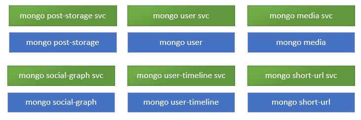
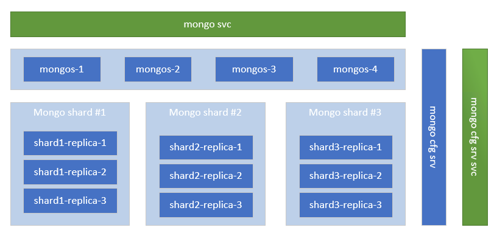
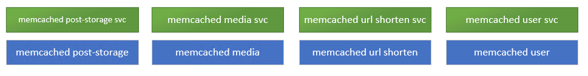

# Social Network Microservices Helm Chart #

# What is Helm Chart ##
Helm charts are packages containing Kubernetes yaml files. Its main goal is to automate the deployment of an application on a Kubernetes cluster. It allows for defining the behaviour of an application and an easy way of manipulating application's parameters. Packages are easily portable across platforms.

## Purpose of this project ##
The main goal of this project is to automate the process of deploying Social Network Microservices on a Kubernetes cluster natively using helm chart. 

## Structure of helm chart  ##
Every microservice is packaged into its own isolated helm chart. All these packages are assembled under one main helm chart. Microservices share the same deployment, service and configmap files templates which are parameterized using values from `values.yaml` file in each microsevice package. Helm charts also share the same config files. The main helm chart contains global values which are shared among microservices but can be individually overridden.

## Shared config files ##
Microservices with same purposes share config files which can be found under `templates/configs` in the main helm chart.
The following subdirectories reflect different types of microservices and contain respective config files.

```
templates/
    configs/
        media-service/
        mongo/
        nginx/
        redis/
        other/
```

All mongo, nginx and redis pods will use the same respective config file from the template. The media-frontend service will use the config files in the media-service folder. The rest of the microservices (that use the all-purpose social network microservices image) will use the config file located in the "other" folder.

In order to override a given value for a config file, a new config (with the new content) must be placed under the same filename in the given microservice template.

## Custom images ##
`nginx-thrift` and `media-frontend` services require mounted lua-scripts (and other files). For this reason, in both of these pods, there is an init container added that pulls the rquired files from the public DSB repository and mounts them in the right path before the container is started.

### Changes to config files ###
In nginx config file, both in `nginx-thrift` and `media-frontend` pods, resolver is set to a value retrieved from global values under `resolverName`. It is set to `kube-dns.kube-system.svc.cluster.local`. <br />

Also `fqdn_suffix` is set to be an environemt variable. Its value is set in `values.yaml` file in corresponding pods. 


### Changes to lua scripts ###
In every lua script where there is a call to a service, a Kubernetes suffix must be added to the name of the service. The suffix is read from the environment variable `fqdn_suffix`. It can be achieved by adding the following code in lua scripts:
```
local k8s_suffix = os.getenv("fqdn_suffix")
service_name = service_name .. k8s_suffix 
```

`fqdn_suffix` is in form `NAMESPACE.svc.cluster.local`. <br />
By default, Kuberentes’ resolver is configured with search domains. However, when we use custom nginx resolver, we need to specify FQDN (Full Qualified Domain Name).


## Deployment ##
In order to deploy services using helm chart, helm needs to be installed (https://helm.sh/).
The following line shows a default deployment of Social Nework Microservices using helm chart:

```
helm install RELEASE_NAME HELM_CHART_REPO_PATH
```

### Setting namespace ###

```
helm install RELEASE_NAME HELM_CHAHELM_CHART_REPO_PATHRT_PATH -n NAMESPACE
```

### Overriding default values ###

#### Default replicas ####
```
helm install RELEASE_NAME HELM_CHART_REPO_PATH --set global.replicas=2
```

#### Default image pull policy ####
```
helm install RELEASE_NAME HELM_CHART_REPO_PATH --set-string global.imagePullPolicy=Always
```

#### compose-post-service pod replicas count ####
```
helm install RELEASE_NAME HELM_CHART_REPO_PATH --set compose-post-service.replicas=3
```

### Setting topology spread constraints ###
Kubernetes allows for controlling pods spread accross the cluster. We can specify the same spread constraints for all the pods or for the given pod.

(https://kubernetes.io/docs/concepts/workloads/pods/pod-topology-spread-constraints/)

#### Same spread constrains for all the pods ####
```
helm install RELEASE_NAME HELM_CHART_REPO_PATH \
 --set-string global.topologySpreadConstraints="- maxSkew: 1
    topologyKey: node
    whenUnsatisfiable: DoNotSchedule
    labelSelector:
      matchLabels:
        service: {{ .Values.name }}"
```

#### Unique spread constrains for compose-post-service ####
```
helm install RELEASE_NAME HELM_CHART_REPO_PATH \
 --set-string compose-post-service.topologySpreadConstraints="- maxSkew: 1
    topologyKey: node
    whenUnsatisfiable: DoNotSchedule
    labelSelector:
      matchLabels:
        service: {{ .Values.name }}"
```

Note: indentations are important in strings that are being passed as parameters.


### Setting resources ###
Kubernetes allows resources (CPU, memory) to be set and assigned to a container. By default, in the helm chart, none of the containers in any service has any resource constraints. We can specify the same resource constraints for all the containers or for the given one.
Example:

#### Same resources for all the containers ####
```
helm install RELEASE_NAME HELM_CHART_REPO_PATH \
  --set-string global.resources="requests: 
      memory: "64Mi"
      cpu: "250m"
    limits:
      memory: "128Mi"
      cpu: "2""
```

#### Setting resources for the compose-post-service container ####

```
helm install RELEASE_NAME HELM_CHART_REPO_PATH \
   --set-string compose-post-service.container.resources="requests: 
      memory: "64Mi"
      cpu: "250m"
    limits:
      memory: "128Mi"
      cpu: "2""
```

#### Same resources for all the containers and unique for compose-post-service ####
```
helm install RELEASE_NAME HELM_CHART_REPO_PATH \
  --set-string global.resources="requests: 
      memory: "64Mi"
      cpu: "250m"
    limits:
      memory: "128Mi"
      cpu: "2"" \
  --set-string compose-post-service.container.resources="requests: 
      memory: "64Mi"
      cpu: "500m"
    limits:
      memory: "128Mi"
      cpu: "4""
```
Note: indentations are important in strings that are being passed as parameters.

If an entry under resources is not specified the value is retrieved from global values (which can be overriden during deployment). <br />
(Documnetation on Kubernetes container resources management: https://kubernetes.io/docs/concepts/configuration/manage-resources-containers/)

## Adding new service ##
To add new service to the helm chart the following steps need to be followed:

- add new helm chart under `charts/`
- add new service to dependencies in `Chart.yaml` file in the main helm chart
```
- name: SERVICE_NAME
    version: VERSION
    repository: file::/charts/SERVICE_NAME
```

- add new service in `templates/configs/other/service-config.tpl`

## MongoDB - deployment options ##
Helm chart supports two options for deploying MongoDB used by social-network:
1. **Default setup** - multiple MongoDB instances are being deployed to handle data for individual services, each one runs in separated Pod. Scalability is limited.


2. **Sharded version** - single MongoDB instance is deployed with support for sharding, replication and persistent storage. Setup reflects real-world usage scenarios. Large data set can be divided into smaller chunks handled by different shards. Each shard has replication enabled to eliminate single point of failure and keep solution highly available. Scaling is possible. More details can be found in [MongoDB documentation](https://docs.mongodb.com/manual/sharding/).

For deploying sharded version chart has been integrated with [Bitnami MongoDB Sharded package](https://github.com/bitnami/charts/tree/master/bitnami/mongodb-sharded/).

### MongoDB - sharding, replication and persistance
### Usage:
```bash
helm install RELEASE_NAME HELM_CHART_REPO_PATH --set global.mongodb.sharding.enabled=true,global.mongodb.standalone.enabled=false --timeout 10m0s
```

Following flags need to be set to disable default setup and enable sharded version: `--set global.mongodb.sharding.enabled=true,global.mongodb.standalone.enabled=false`. This is mandatory.

Sharded MongoDB deployment might exceed default timeout set by Helm for installation (300 seconds). Therefore it might be required to raise the time by using timeout flag: `--timeout 10m0s`.

Default settings used by deployment are present in parent `values.yaml` file:
```yaml
mongodb-sharded:
  fullnameOverride: mongodb-sharded
  shards: 3
  mongodbRootPassword: *mongodb-sharded-password
  shardsvr:
    dataNode:
      replicas: 3
```

All settings can be overriden/customized by providing `--set` flags.

Detailed settings list and documentation can be found at [Bitnami MongoDB github page](https://github.com/bitnami/charts/tree/master/bitnami/mongodb-sharded/#parameters).

### Examples:
**Note:** all settings should be prefixed with chart name - `mongodb-sharded`
1. Set shards number: `--set mongodb-sharded.shards=3`
2. Set replicas count for shard: `--set mongodb-sharded.shardsvr.dataNode.replicas=3`
3. Set number of mongos instances: `--set mongodb-sharded.mongos.replicas=5`

### Enable sharding for collections:
Each collection needs to be configured for sharding. This is handled by Helm post-install hook. Dedicated scripts is injected into Kubernetes as a ConfigMap.
Implementation: `templates/hooks/mongodb/configmap.yaml`.
Hook logs can be found in `setup-collection-sharding-hook` pod. Some errors might be present until MongoDB is fully deployed.

Expected logs:
```
2022-03-23 15:12:37,567 [INFO] Connection created
2022-03-23 15:12:37,568 [INFO] Creating db: media
2022-03-23 15:12:37,582 [INFO] DB media created
2022-03-23 15:12:37,583 [INFO] Enable sharding for: media
2022-03-23 15:12:44,698 [INFO] Sharding enabled for media
2022-03-23 15:12:44,698 [INFO] Sharding collection : media.media
2022-03-23 15:12:53,747 [INFO] Collection media.media sharded
2022-03-23 15:12:53,748 [INFO] Creating db: post
2022-03-23 15:12:53,788 [INFO] DB post created
2022-03-23 15:12:53,788 [INFO] Enable sharding for: post
2022-03-23 15:12:53,880 [INFO] Sharding enabled for post
2022-03-23 15:12:53,882 [INFO] Sharding collection : post.post
2022-03-23 15:12:53,995 [INFO] Collection post.post sharded
2022-03-23 15:12:53,995 [INFO] Creating db: social-graph
2022-03-23 15:12:54,046 [INFO] DB social-graph created
2022-03-23 15:12:54,047 [INFO] Enable sharding for: social-graph
2022-03-23 15:12:54,185 [INFO] Sharding enabled for social-graph
2022-03-23 15:12:54,185 [INFO] Sharding collection : social-graph.social-graph
2022-03-23 15:12:54,237 [INFO] Collection social-graph.social-graph sharded
2022-03-23 15:12:54,237 [INFO] Creating db: url-shorten
2022-03-23 15:12:54,263 [INFO] DB url-shorten created
2022-03-23 15:12:54,264 [INFO] Enable sharding for: url-shorten
2022-03-23 15:12:54,311 [INFO] Sharding enabled for url-shorten
2022-03-23 15:12:54,311 [INFO] Sharding collection : url-shorten.url-shorten
2022-03-23 15:12:54,476 [INFO] Collection url-shorten.url-shorten sharded
2022-03-23 15:12:54,478 [INFO] Creating db: user
2022-03-23 15:12:54,496 [INFO] DB user created
2022-03-23 15:12:54,497 [INFO] Enable sharding for: user
2022-03-23 15:12:54,555 [INFO] Sharding enabled for user
2022-03-23 15:12:54,556 [INFO] Sharding collection : user.user
2022-03-23 15:12:54,596 [INFO] Collection user.user sharded
2022-03-23 15:12:54,597 [INFO] Creating db: user-timeline
2022-03-23 15:12:54,611 [INFO] DB user-timeline created
2022-03-23 15:12:54,611 [INFO] Enable sharding for: user-timeline
2022-03-23 15:12:54,698 [INFO] Sharding enabled for user-timeline
2022-03-23 15:12:54,698 [INFO] Sharding collection : user-timeline.user-timeline
2022-03-23 15:12:54,746 [INFO] Collection user-timeline.user-timeline sharded
```

Helm install output:
```bash
helm install dsb socialnetwork --set global.mongodb.sharding.enabled=true,global.mongodb.standalone.enabled=false --timeout 10m0s
Pod setup-collection-sharding-hook pending
Pod setup-collection-sharding-hook pending
Pod setup-collection-sharding-hook pending
Pod setup-collection-sharding-hook running
Pod setup-collection-sharding-hook succeeded
NAME: dsb
LAST DEPLOYED: Wed Mar 23 16:09:21 2022
NAMESPACE: default
STATUS: deployed
REVISION: 1
TEST SUITE: None
```

### Persistance:
By default sharded version prepares Persitent Volume Claims (PVCs) to store data. This requires PV provisioner support in the underlying infrastructure and ReadWriteMany volumes for deployment scaling.

After uninstalling helm chart, PVCs created by MongoDB installation won't be removed. This can be removed manually by running following shell script:
```bash
for p in $(kubectl get pvc -o name -l app.kubernetes.io/name=mongodb-sharded); do kubectl delete $p; done
```

## MemcacheD - deployment options ##
There're two options to deploy MemcacheD using socialnetwork helm chart:
1. **Default setup** - separated MemcacheD pods are deployed and used by different services. Scalability is limited - increasing number of replicas doesn't guarantee data consistency between MemcacheD pods. Cache misses might be observed when more replicas of MemcacheD is running - cached data is split across all pods. Restart of MemcacheD pods will force application to repopulate the cache from scratch. `Binary protocol` is used for communication between client and MemcacheD instance.


2. **Clustered setup** - MemcacheD replicas are deployed along with [mcrouter service](https://github.com/facebook/mcrouter/wiki) to achieve replication and data consistency between MemcacheD pods. In this scenario applications can benefit from parallel reads from all MemcacheD replicas without a risk of hitting cache miss. For large data volumes it's also possible to configure sharding to overcome memory limits. Due to [mcrouter limitation](https://github.com/facebook/mcrouter/issues/6) it's only possible to use `ASCII protocol`. To use clustered setup services need to use separated key spaces to avoid colissions.

### Usage:
```bash
helm install RELEASE_NAME HELM_CHART_REPO_PATH --set global.memcached.cluster.enabled=true,global.memcached.standalone.enabled=false --timeout 10m0s
```
Following flags need to be set to disable default setup and enable sharded version: `--set global.memcached.cluster.enabled=true,global.memcached.standalone.enabled=false`. This is mandatory.

Mcrouter installation is handled by separated Helm chart wich was added as dependency to social-network chart. Default installation settings are part of parent `values.yaml` file:
```yaml
mcrouter:
  controller: statefulset
  memcached:
    replicaCount: 3
  mcrouterCommandParams.port: *memcached-cluster-port
```

[Mcrouter chart](https://artifacthub.io/packages/helm/evryfs-oss/mcrouter) also handles MemcacheD installation. MemcacheD is installed using dedicated Bitnami chart. Custom settings can be provided in `mcrouter.memcached` section - all will be passed to Bitami MemcacheD chart during installation. All settings can be found in [chart documentation](https://artifacthub.io/packages/helm/bitnami/memcached/5.15.14).

Detailed mcrouter overview can be found [here](https://engineering.fb.com/2014/09/15/web/introducing-mcrouter-a-memcached-protocol-router-for-scaling-memcached-deployments/#:~:text=Mcrouter%20is%20a%20memcached%20protocol,5%20billion%20requests%20per%20second.).

### mcrouter configuration:
Mcrouter configuration is stored in dedicated `ConfigMap` - default installation generates broken config file - MemcacheD server list is not matching actual MemcacheD pods. To overcome this issue dedicated `post-install` hook was developed to fix setup and also give an option to customize mcrouter behaviour.

Implementation of the hook and mcrouter config template can be found in `templates/hooks/mcrouter` folder.

Mcrouter config template - default configuration enables replication for single MemcacheD pool:
```json
{
    "pools": {
    "A": {
        "servers": [
            "MEMCACHED_SERVERS_LIST"
        ]
    }
    },
    "route": {
    "type": "OperationSelectorRoute",
    "default_policy": "PoolRoute|A",
    "operation_policies": {
            "add": "AllFastestRoute|Pool|A",
            "delete": "AllFastestRoute|Pool|A",
            "get": "LatestRoute|Pool|A",
            "set": "AllFastestRoute|Pool|A"
        }
    }
}
```


Hook waits for mcrouter and MemcacheD deployments to be available, lists MemcacheD pods and recreates mcrouter `ConfigMap` with correct list of MemcacheD instances. Afterwards it triggers mcrouter restart to reload new config.

Expected hook logs (can be inspected by running `kubectl logs setup-mcrouter-configmap`):
```bash
aiting for 1 pods to be ready...
partitioned roll out complete: 1 new pods have been updated...
Waiting for 3 pods to be ready...
Waiting for 2 pods to be ready...
Waiting for 1 pods to be ready...
partitioned roll out complete: 3 new pods have been updated...
Generating new config.json with following list of memcached nodes-> "dsb-memcached-0.dsb-memcached:11211","dsb-memcached-1.dsb-memcached:11211","dsb-memcached-2.dsb-memcached:11211"
Generating new config map -> dsb-mcrouter
Warning: resource configmaps/dsb-mcrouter is missing the kubectl.kubernetes.io/last-applied-configuration annotation which is required by kubectl apply. kubectl apply should only be used on resources created declaratively by either kubectl create --save-config or kubectl apply. The missing annotation will be patched automatically.
configmap/dsb-mcrouter configured
Restarting statefulset -> dsb-mcrouter
statefulset.apps/dsb-mcrouter restarted
Waiting for statefulset to be ready -> dsb-mcrouter
Waiting for partitioned roll out to finish: 0 out of 1 new pods have been updated...
Waiting for 1 pods to be ready...
Waiting for 1 pods to be ready...
partitioned roll out complete: 1 new pods have been updated...
```

Helm install output:
```bash
helm install dsb socialnetwork --set global.memcached.cluster.enabled=true,global.memcached.standalone.enabled=false
Pod setup-mcrouter-configmap pending
Pod setup-mcrouter-configmap pending
Pod setup-mcrouter-configmap running
Pod setup-mcrouter-configmap succeeded
NAME: dsb
LAST DEPLOYED: Mon Jun 27 13:33:50 2022
NAMESPACE: default
STATUS: deployed
REVISION: 1
TEST SUITE: None
```

## Redis - deployment options ##
The are two ways to deploy redis:

1. **Default setup** (standalone) - single replica of Redis is deployed for each service (similar to MongoDB). Scaling is not possible.

2. **Replicated setup** - single master and multiple replicas are deployed. It allows scaling read operations - in this scenario we can spread the load across all replicas. Scaling inserts/updates is not possible since we run only single Redis master. Application is ready to handle both services and route `read` operations to dedicated Redis service (`redis-replicas`) and all `insert` and `update` operations to `redis-master`. For detailed documentation refer to official [Redis helm chart repository](https://github.com/bitnami/charts/tree/main/bitnami/redis/#bitnami-package-for-redisr). Settings can be overriden in global `values.yaml` - see `redis` section. Also additional `--set` flags can be provided during installation to change default settings.


### Usage:
```bash
helm install RELEASE_NAME HELM_CHART_REPO_PATH --set global.redis.replication.enabled=true,global.redis.standalone.enabled=false
```

3. **Clustered setup** - multi-master setup improving read/write performance, it requires PV provisioner to be present in the cluster. More details and documentation can be found in [Redis Cluster helm chart documentation](https://github.com/bitnami/charts/tree/master/bitnami/redis-cluster)


Helm install output:
```bash
helm install dsb socialnetwork --set global.redis.cluster.enabled=true,global.redis.standalone.enabled=false --timeout 10m0s
Pod redis-cluster-readiness-hook pending
Pod redis-cluster-readiness-hook pending
Pod redis-cluster-readiness-hook pending
Pod redis-cluster-readiness-hook running
Pod redis-cluster-readiness-hook succeeded
NAME: dsb
LAST DEPLOYED: Tue Aug  9 11:03:20 2022
NAMESPACE: default
STATUS: deployed
REVISION: 1
TEST SUITE: None
```

After helm chart installation dedicated post-install hook starts and observes Redis Cluster deployment and waits until it's fully configured:

```bash
2022-08-09 09:06:03,599 [ERROR] Could not connect to Redis Cluster. Sleeping for 5 seconds
Traceback (most recent call last):
  File "/tmp/redis_readiness_check.py", line 16, in <module>
    redis_cluster_connection = RedisCluster(host=redis_cluster_uri)
  File "/usr/local/lib/python3.10/site-packages/redis/cluster.py", line 560, in __init__
    self.nodes_manager = NodesManager(
  File "/usr/local/lib/python3.10/site-packages/redis/cluster.py", line 1267, in __init__
    self.initialize()
  File "/usr/local/lib/python3.10/site-packages/redis/cluster.py", line 1558, in initialize
    raise RedisClusterException(
redis.exceptions.RedisClusterException: Redis Cluster cannot be connected. Please provide at least one reachable node.
2022-08-09 09:06:08,659 [INFO] cluster 10.250.228.147:6379 -> cluster state: ok
2022-08-09 09:06:08,660 [INFO] cluster 10.250.228.137:6379 -> cluster state: ok
2022-08-09 09:06:08,660 [INFO] cluster 10.250.230.194:6379 -> cluster state: ok
2022-08-09 09:06:08,660 [INFO] cluster 10.250.230.234:6379 -> cluster state: ok
2022-08-09 09:06:08,660 [INFO] cluster 10.250.230.191:6379 -> cluster state: ok
2022-08-09 09:06:08,660 [INFO] cluster 10.250.224.88:6379 -> cluster state: ok
2022-08-09 09:06:13,665 [INFO] Redis Cluster is configured and ready to use!
```

Implementation of the hook can be found in `templates/hooks/redis-cluster` folder.

### Usage:
```bash
helm install RELEASE_NAME HELM_CHART_REPO_PATH --set global.redis.cluster.enabled=true,global.redis.standalone.enabled=false --timeout 10m0s
```

### Persistance:
After uninstalling helm chart, PVCs created by Redis Cluster installation won't be removed. This can be removed manually by running following shell script:
```bash
for p in $(kubectl get pvc -o name -l app.kubernetes.io/name=redis-cluster); do kubectl delete $p; done
```
